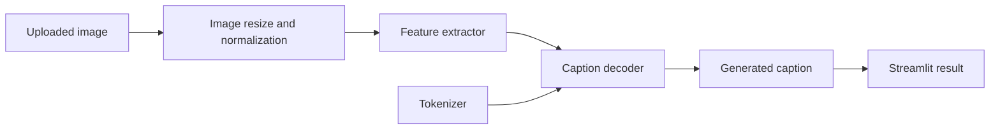

# Gen AI Captioning


This repository contains an image-captioning Streamlit app backed by trained TensorFlow/Keras artifacts. It is an early generative AI portfolio project showing the classic CNN feature-extractor plus sequence decoder approach to image caption generation.

## Features

- Upload JPG, JPEG, or PNG images
- Load trained caption model, feature extractor, and tokenizer
- Generate captions with greedy decoding
- Display the uploaded image with the generated caption
- Cache model assets to avoid reloading on every Streamlit interaction
- Clear errors when model artifacts are missing

## Architecture



## Project Structure

```text
gen-ai-captioning/
|-- main.py                  # Streamlit entrypoint
|-- requirements.txt
|-- README.md
|-- .gitignore
|-- models/
    |-- model.keras
    |-- feature_extractor.keras
    `-- tokenizer.pkl
|-- notebooks/
|   `-- flickr8k_image_captioning_cnn_lstm.ipynb
|-- src/
|   `-- image_captioning/
|       |-- app.py           # UI orchestration
|       |-- captioner.py     # artifact loading and decoding logic
|       `-- config.py        # artifact paths and decoding settings
|-- tests/
|   `-- test_artifacts.py
`-- .github/workflows/ci.yml
```

## Quick Start

```bash
python -m venv .venv
.venv\\Scripts\\activate
pip install -r requirements.txt
streamlit run main.py
```

On macOS/Linux:

```bash
source .venv/bin/activate
```

## Model Artifacts

The app expects these files in `models/`:

```text
model.keras
feature_extractor.keras
tokenizer.pkl
```

These artifacts are committed in the current repository for demonstration. For a production repository, store large model artifacts in GitHub Releases, cloud storage, or Git LFS instead of regular Git history.

## Security Notes

- `tokenizer.pkl` is a pickle artifact. Only load pickle files from trusted sources.
- Uploaded files are processed locally by Streamlit and are not persisted by the app.
- The model is an educational demo and should be evaluated before any real product use.

## Performance Improvements Included

- Model and tokenizer loading is cached with `st.cache_resource`.
- Matplotlib figures are closed after rendering.
- Dependency file was reduced to direct runtime dependencies.
- Captioning logic is separated into a reusable package under `src/`.
- CI verifies the committed artifact contract.

## Development Workflow

```bash
set PYTHONPATH=src
pytest -q
python -m compileall main.py src
streamlit run main.py
```

On macOS/Linux:

```bash
export PYTHONPATH=src
```

## Roadmap

- Move large model files to GitHub Releases or Git LFS
- Add beam search decoding
- Add sample images and expected outputs
- Add model card with training data, metrics, and limitations

## Troubleshooting

| Issue | Fix |
|---|---|
| Missing model artifact | Confirm all required files exist inside `models/`. |
| TensorFlow install fails | Use a supported Python version and reinstall from `requirements.txt`. |
| Caption is poor | Retrain or fine-tune the model and document evaluation metrics. |

## License

No license file is currently included. Add a license before reusing or distributing this project.
